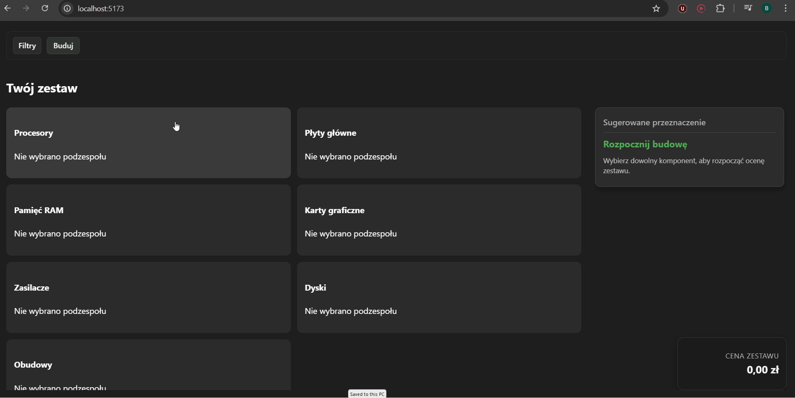
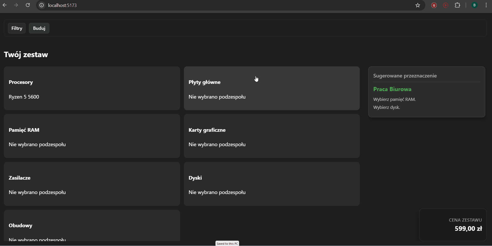
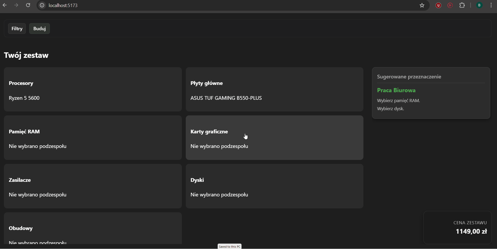
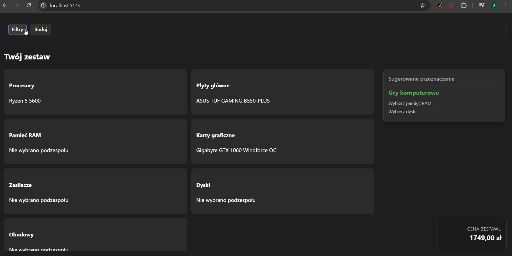
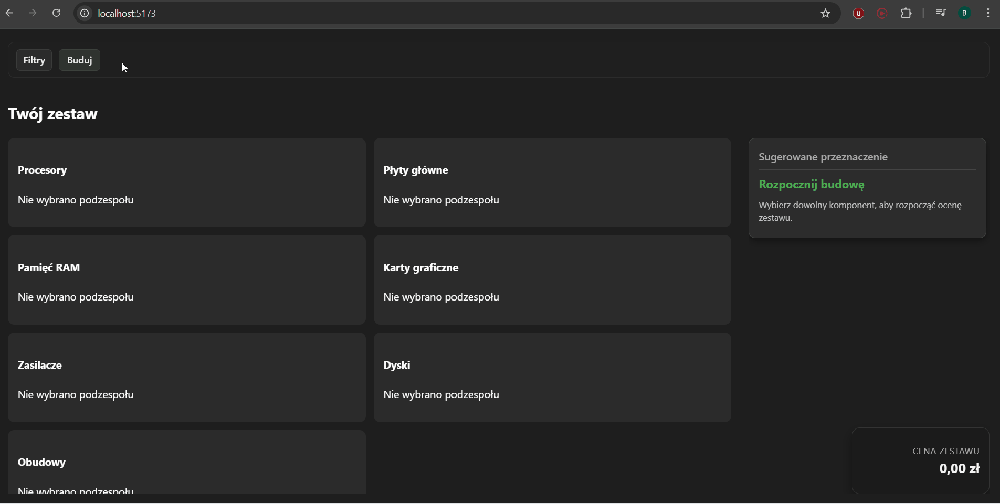

# PC Configurator 🖥️

Projekt inżynierski: aplikacja do konfiguracji zestawów komputerowych.  
Backend: **Django** + **Django REST Framework**, frontend: **React** (Vite).

## Funkcje
- Modele dla podzespołów komputerowych (CPU, GPU, RAM, płyta główna, itp.).
- Zestawy (Builds) oraz REST API do zarządzania danymi.
- Panel admina do wprowadzania danych.
- Widok szczegółów z lokalnymi uwagami kompatybilności.
- Listy podzespołów sortowane po kompatybilności i cenie.

---

## Demo







## Technologie
- Python 3.10+
- Django 5.x
- Django REST Framework
- SQLite (domyślnie) lub PostgreSQL (zalecane)
- React 19 + Vite

---

## Instalacja i uruchomienie

### Klonowanie repozytorium
```bash
git clone https://github.com/Bartmannn/PConfigurer.git
cd PConfigurer
```

### Docker

```bash
docker compose build
docker compose up
```

Dla starszej wersji Dockera należy użyć poleceń:
```bash
docker-compose build
docker-compose up
```

### Lokalnie

#### 1. Backend (Django)
```bash
cd backend
python -m venv venv
source venv/bin/activate  # Windows: venv\Scripts\activate
pip install -r requirements.txt
python manage.py makemigrations
python manage.py migrate
python manage.py createsuperuser
python manage.py runserver
```

#### 2. Frontend (React + Vite)
```bash
cd frontend
npm install
npm run dev
```

## API (przykłady)
- GET /api/cpus/ -> lista procesorów
- GET /api/gpus/ -> lista kart graficznych
- GET /api/filters/options/ -> dane do filtrów
- POST /api/builds/ -> utworzenie nowego zestawu
- GET /admin/ -> panel administratora

## Struktura projektu
```
PConfigurer/
|-- backend/                            -- warstwa serwerowa
|   |-- backend/                        -- konfiguracja projektu Django
|   |-- core/                           -- logika aplikacji
|   |   |-- filterset.py                -- definicje filtrów
|   |   |-- fixtures/                   -- dane testowe
|   |   |-- migrations/                 -- migracje bazy danych
|   |   |-- models.py                   -- modele danych
|   |   |-- serializer.py               -- serializacja modeli
|   |   |-- services/                   -- usługi domenowe
|   |   |-- tools.py                    -- funkcje pomocnicze
|   |   `-- views.py                    -- widoki API
|   |-- db.sqlite3                      -- lokalna baza testowa
|   |-- manage.py                       -- narzędzia zarządzania
|   `-- requirements.txt                -- wymagane moduły Pythona
`-- frontend/                           -- warstwa kliencka
    |-- public/                         -- pliki statyczne
    `-- src/                            -- źródła aplikacji React
        |-- assets/                     -- zasoby graficzne
        |-- context/                    -- konteksty aplikacji
        |   `-- ConfiguratorContext.jsx -- kontekst konfiguratora
        |-- pages/                      -- widoki stron
        |   `-- Configurator.jsx        -- strona konfiguratora
        |-- services/                   -- usługi API
        |   |-- BuildEvaluationService.js -- ocena konfiguracji
        |   `-- remarksService.js       -- uwagi i komentarze
        `-- vertical-components/        -- komponenty układu
            |-- BuildEvaluation.jsx     -- widok oceny
            |-- ComponentDetails.jsx    -- szczegóły komponentu
            |-- ComponentList.jsx       -- lista komponentów
            |-- ConfiguratorLayout.jsx  -- układ konfiguratora
            |-- FiltersPanel.jsx        -- panel filtrów
            |-- SelectView.jsx          -- widok wyboru
            `-- SummaryView.jsx         -- widok podsumowania
```

## Autor
Projekt inżynierski - Bartosz Bohdziewicz
